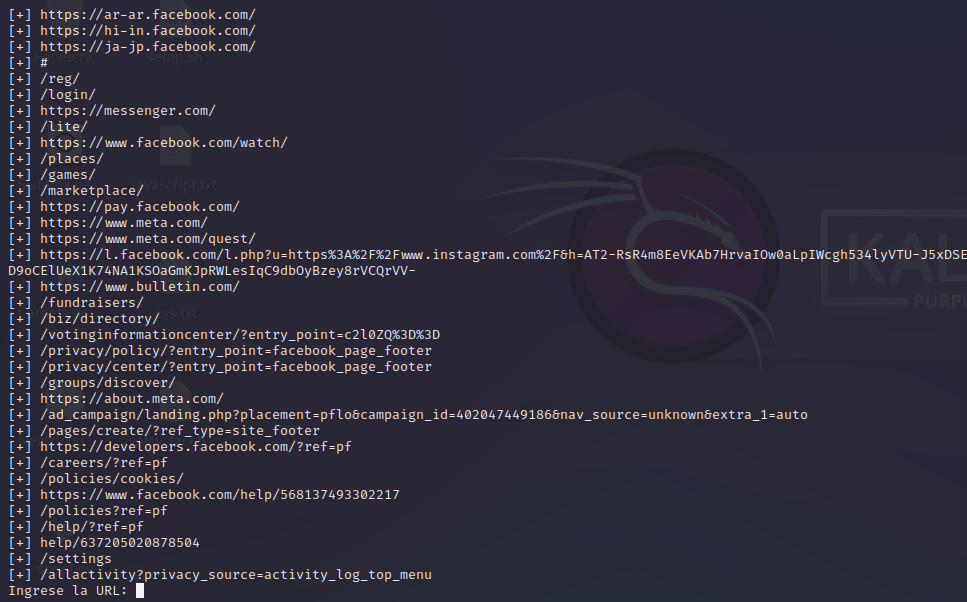

<p align="center">

</p>

Web scraping es una técnica de extracción de datos utilizada para recopilar información de páginas web de forma automatizada.

El proceso de web scraping generalmente implica la automatización de solicitudes HTTP a través de la red, la extracción de datos relevantes de la respuesta del servidor web y el almacenamiento de los datos extraídos en un formato estructurado.

```
git clone https://github.com/bl4ck44/Web-Scraping.git

cd Web-Scraping

pip3 install -r requirements.txt

python3 scraping.py
```

<p align="center">

</p>

<p align="center">

</p>